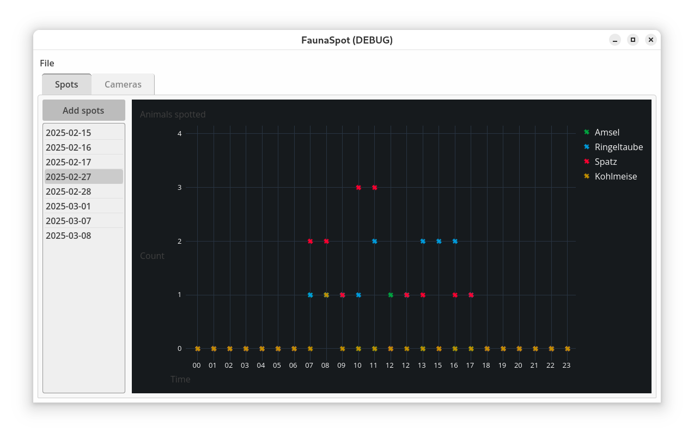
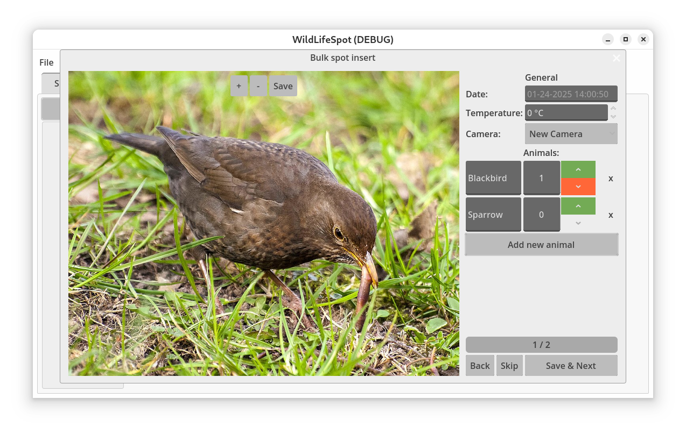
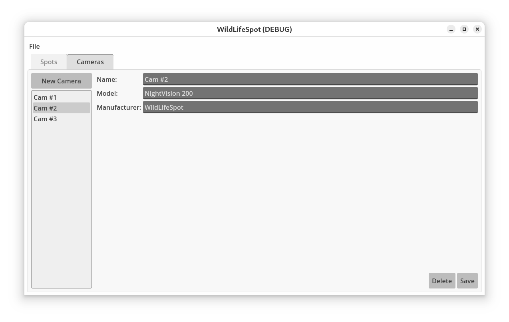

# FaunaSpot

FaunaSpot is a tool that supports you in processing photos (e.g. taken by camera traps) and classifying depicted animals. Based on the data, it will generate graphs to help you understand animal behavior like peek times on a feeding ground.

Features:

- Inventorize your camera traps
- Bulk process photos
- Record animals and temperatures
- Visualize animal behavior in graphs

## Screenshots

Spotted animals are displayed as diagrams, allow to see e.g. peak times of animal activity.

The bulk spot feature enables to process a big batch of camera trap pictures at once. You just have to classify and count visible animals. FaunaSpot takes care of the rest.

Inventorize your camera traps.

